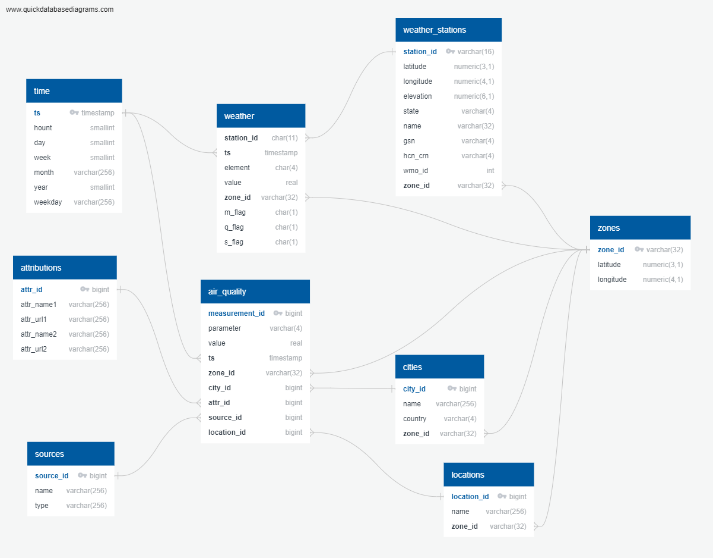
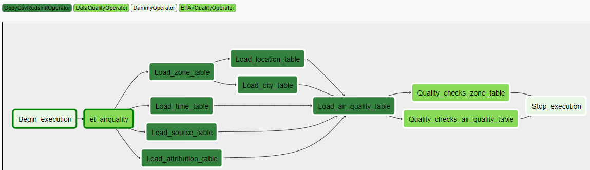
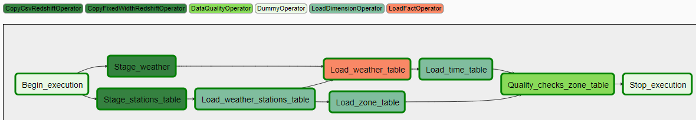

# DEP6 - Data engineering Capstone Project
Project 6 of the Data Engineering Nanodegree <br>
Michal Pytlos, November 2019

### Overview
DEP6 combines two large open datasets, on weather and on air quality, into a data warehouse. The purpose of the data warehouse is to provide the means of:
* investigation of the influence of weather conditions on the air quality
* investigation of spatial and time variation of air quality
* investigation of spatial and time variation of weather conditions

The data warehouse is to be primarily used by data analysts and scientsts. Example queries might ask the following questions:
* what is the correlation between the pollution level and wind speed for a given temperature range in a given area?
* what is the effect of snow on the pollution level?
* how did pollution levels change in various cities across a country with time?

#### Datasets
1. Weather - [NOAA Global Historical Climatology Network Daily (GHCN-D)](https://registry.opendata.aws/noaa-ghcn/)
  * Daily weather measurements over global land areas from NOAA (1763 - present)
  * Documentation: https://docs.opendata.aws/noaa-ghcn-pds/readme.html
  * Over 30,000,000 data points in 2017
  * Data format: csv and fixed-width
2. Air quality - [OpenAQ](https://registry.opendata.aws/openaq/)
  * "*Global, aggregated physical air quality data from public data sources provided by government, research-grade and other sources.*" [[OpenAQ](https://registry.opendata.aws/openaq/)]
  * Over 100,000 data points per day in 2017 (multiple times more in 2019)
  * Data format: ndjson

#### Steps taken in the project
1. Research and choice of the datasets for the project
2. Research and choice of the technologies for the project
3. Development and testing
4. Documentation


#### Data model
The adopted data model is shown in Figure 1. The tables form a star schema with two fact (*weather* and *air_quality*) and seven dimesion tables (*zones*, *time*, *cities*, *locations*, *weather_stations*, *sources* and *attributions*). The chosen schema, compared to a highly normalized schema, allows for easier and faster data analytics by making the queries much simpler (fewer joins). The *weather* and *air_quality* tables are designed to be joined on time and/or zone; this is meant to simplify the investigation of the influence of weather on the pollution level.



*Figure 1: Data model*

#### ETL
The air quality and weather data pipelines are defined in Apache Airflow as the directed acyclic graphs (DAG) shown in Figures 2 and 3 respectively. DAG instances as well as individual tasks are managed and monitored using Airflow's UI. New air quality and weather data is to be added on a daily and on an annual basis respectively.



*Figure 2: Air quality DAG*



*Figure 3: Weather DAG*

DEP6 defines the following operators (colour legend in Figures 2 and 3):
* ETAirQualityOperator
  * Extracts air quality data from S3 (nested ndjson files), transforms the data using pandas and saves the output to S3 (CSV files)
* CopyCsvRedshiftOperator
  * Copies data from CSV files stored on S3 to table on Redshift
* CopyFixedWidthRedshiftOperator
  * Copies data from a fixed-width file stored on S3 to table on Redshift
* LoadDimensionOperator
  * Executes given insert query on Redshift optionally deleting all entries from the target table prior to the insert.
* LoadFactOperator
  * Executes given insert query on Redshift
* DataQualityOperator
  * Executes given select query on Redshift and compares the result with the given expected value; if the values differ, raises an exception.

#### Technologies
The following technology choices were made:
* Database - Amazon Redshift for the following reasons:
  * designed for data warehouses
  * distributed scalable system with columnar storage which is able to handle large amounts of data and multiple concurrent users
  * SQL database - query language the potential users are likely to be faimilar with
  * source datasets are in S3
* ETL orchestration tool - Apache Airflow:
  * open-source, widely used and tested tool with good documentation
  * UI allowing for easy inspection and management of ETL jobs
  * good logging and reporting functionalities out of the box
  * ETL defined as code
* Data transformation tool for air quality data: pandas (Python library)
  * simple tool with excellent documentation
  * data is in the nested ndjson format which makes direct copy to Redshift difficult - Redshift Spectrum would have to be used which would make the solution more expensive
  * the amount of data (up to few hundred MB per day) is small enough to easily fit into memory of one machine
* Data storage - S3:
  * integration with Redshift (fast and easy data transfers)


### Other scenarios
#### Data is increased by 100x
The usage of pandas for the transformation of air quality data would not be a viable option anymore due to the memory requirement. This process would have to be handled either by Redshift Spectrum which is capable of ingesting nested data or a data processing engine running on a cluster such as Spark. The other DEP6 tasks use solely Redshift for data ingestion and transformation and Redshift is fine with handling large amounts of data since it is a distributed system.
#### Pipeline is run on a daily basis by 7am every daily
The air quality pipeline is already scheduled to run daily (in backfilling mode). Changing the schedule in Airflow to 7am daily is a matter of modyfying one line of code in the DAG file (set schedule_interval parameter to '0 7 &ast; &ast; &ast;').
#### Database is accessed by 100+ people
No technology or code changes are required in this scenario as Redshift is capable of handling multiple queries simultaneously. The Redshift cluster would have to be scaled up (more and better nodes) but this is a very simple and quick process in AWS.

### Prerequisites
* Python 3.6.3 or higher with:
  * psycopg2 2.8 or higher
  * pandas 0.25.3 or higher
  * s3fs 0.3.5 or higher
* Apache Airflow 1.10.6 or higher with postgres subpackage
* Access to Amazon Redshift cluster in the us-east-1 region (input datasets are kept in S3 in this region)
* S3 bucket in the us-east-1 region
* Optionally: Virtual machine in the us-east-1 region (EC2) to host Apache Airflow

### Configuration
#### Create tables script
Set the configuration variables in **ct.cfg** as per below:

| Section | Field  | Value*|
| -------| --------|-------|
| CLUSTER| HOST| endpoint provided in the Redshift management console without the port part|
| CLUSTER| DB_NAME| Redshift database name|
| CLUSTER| DB_USER| Redshift master user|
| CLUSTER| DB_PASSWORD| Redshift master user password|
| CLUSTER| DB_PORT| Redshift database port (default is 5439)|

*&ast;All field values in ct.cfg must be inside single quotes*

#### Airflow
1. Set `dags_folder` in **airflow.cfg** to path to DEP6 **dags** directory
2. Set `plugins_folder` in **airflow.cfg** to path to DEP6 **plugins** directory
3. Set empty values in **dp.cfg**:
    1. `iam_role_arn` to ARN of IAM role allowing Redshift to read from S3
    2. `aws_access_key_id` to Access key ID of user with AmazonS3FullAccess permission
    3. `aws_secret_access_key` to Secret access key of user with AmazonS3FullAccess permission
    4. `s3_out_aq_bucket` to name of S3 bucket where *Extract & transform air quality data operator* is to save the output data
    5. `s3_out_aq_prefix` to s3 prefix common to all output data files to be saved by *Extract & transform air quality data operator*
4. Import variables from **dp.cfg** to Airflow:
    1. in Airflow UI open Admin Tab
    2. Select Variables from dropdown menu
    3. Select **dp.cfg** and import variables
5. Create redshift connection in Airflow:
    1. in Airflow UI open Admin Tab
    2. Select Connections from dropdown menu
    3. Open Create tab
    4. Fill in the fields as per below:


  | Field     | Value                                    |
  | --------- | ---------------------------------------- |
  | Conn id   | redshift                                 |
  | Conn Type | Postgres                                 |
  | Host      | endpoint provided in the Redshift management console without the port part |
  | Schema    | Redshift database name                   |
  | Login     | Redshift master user                     |
  | Password  | Redshift master user password            |
  | Port      | Redshift database port (default is 5439) |

### Usage
To create staging and analytics tables on Redshift:
1. Navigate to the directory containing **create_tables.py**
2. Run `python create_tables.py`

To activate, manage and monitor the DAG use Airflow UI

### File structure
File structure of the program is outlined below.
```
DE_p6
├── create_tables
│   ├── create_tables.py
│   ├── ct.cfg
│   └── sql_queries.py
├── dags
│   ├── airquality_dag.py
│   ├── sql_queries.py
│   └── weather_dag.py
├── dp.cfg
├── plugins
│   ├── __init__.py
│   └── operators
│       ├── copy_csv.py
│       ├── copy_fixedwidth.py
│       ├── data_quality.py
│       ├── et_airquality.py
│       ├── __init__.py
│       ├── load_dimension.py
│       └── load_fact.py
└── README.md
```
Chosen files and directories are briefly described in the table below.

| File/directory    | Description                                             |
|-------------------| --------------------------------------------------------|
| create_tables/    | Directory containing create tables tool                 |
| create_tables.py  | Create tables script                                    |
| ct.cfg            | Configuration file for create tables script             |
| sql_queries.py    | SQL statements used by create table script              |
| dags/             | Directory with DAGs                                     |
| airquality_dag.py | Definition of DAG for air quality data                  |
| sql_queries.py    | SQL statements used by operators                        |
| weather_dag.py    | Definition of DAG for weather data                      |
| dp.cfg            | File with configuration variables to be imported into Airflow |
| plugins/          | Directory with custom plugins used by DEP6 DAG          |
| operators/        | Directory with custom operators used by DEP6 DAG        |
| copy_csv.py       | Copy CSV data to Redshift operator                      |
| copy_fixedwidth.py| Copy fixed-width data to Redshift operator              |
| data_quality.py   | Data quality operator                                   |
| et_airquality.py  | Extract & transform air quality data operator           |
| load_dimension.py | Load dimension operator                                 |
| load_fact.py      | Load fact operator                                      |
